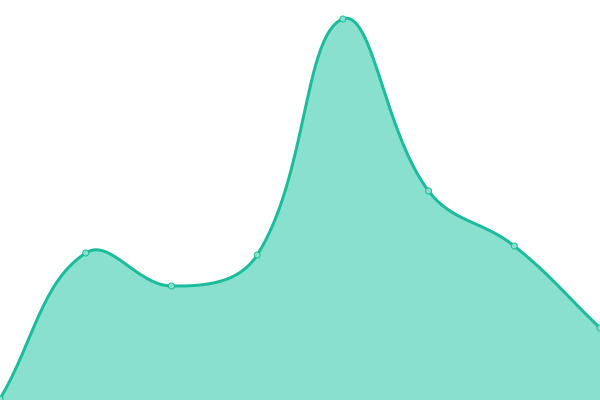
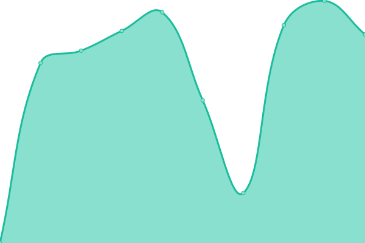

# [📈 Live Status](https://demo.upptime.js.org): <!--live status--> **🟩 All systems operational**

This repository contains the open-source uptime monitor and status page for [Upptime](https://upptime.js.org), powered by [Upptime](https://github.com/upptime/upptime).

With [Upptime](https://upptime.js.org), you can get your own unlimited and free uptime monitor and status page, powered entirely by a GitHub repository. We use [Issues](https://github.com/upptime/upptime/issues) as incident reports, [Actions](https://github.com/frpalmap/upptimesipeca/actions) as uptime monitors, and [Pages](https://demo.upptime.js.org) for the status page.

<!--start: status pages-->
<!-- This summary is generated by Upptime (https://github.com/upptime/upptime) -->
<!-- Do not edit this manually, your changes will be overwritten -->
<!-- prettier-ignore -->
| URL | Status | History | Response Time | Uptime |
| --- | ------ | ------- | ------------- | ------ |
|  [Ferretería](www.ferreteriaportuguesa.com) | 🟩 Up | [ferreteria.yml](https://github.com/frpalmap/uptimesipeca/commits/HEAD/history/ferreteria.yml) | 

 237ms
     
 | 

<a href="https://frpalmap.github.io/uptimesipeca/history/ferreteria">100.00%</a>
    

|  [Youtube](www.youtube.com) | 🟩 Up | [youtube.yml](https://github.com/frpalmap/uptimesipeca/commits/HEAD/history/youtube.yml) | 

 372ms
     
 | 

<a href="https://frpalmap.github.io/uptimesipeca/history/youtube">100.00%</a>
    

|  [Wikipedia](https://en.wikipedia.org) | 🟩 Up | [wikipedia.yml](https://github.com/frpalmap/uptimesipeca/commits/HEAD/history/wikipedia.yml) | 

 176ms
     
 | 

<a href="https://frpalmap.github.io/uptimesipeca/history/wikipedia">100.00%</a>
    

|  [Fundacion Higea](www.fundacionhigea.org) | 🟩 Up | [fundacion-higea.yml](https://github.com/frpalmap/uptimesipeca/commits/HEAD/history/fundacion-higea.yml) | 

 345ms
     
 | 

<a href="https://frpalmap.github.io/uptimesipeca/history/fundacion-higea">100.00%</a>
    

|  [RedHigea](www.redhigea.com) | 🟩 Up | [red-higea.yml](https://github.com/frpalmap/uptimesipeca/commits/HEAD/history/red-higea.yml) | 

 1606ms
     
 | 

<a href="https://frpalmap.github.io/uptimesipeca/history/red-higea">100.00%</a>
    

|  [CDHM](www.centrodiagnosticohigea.com) | 🟩 Up | [cdhm.yml](https://github.com/frpalmap/uptimesipeca/commits/HEAD/history/cdhm.yml) | 

 352ms
     
 | 

<a href="https://frpalmap.github.io/uptimesipeca/history/cdhm">99.40%</a>
    

|  [Itecnologica](www.itecnologica.com) | 🟩 Up | [itecnologica.yml](https://github.com/frpalmap/uptimesipeca/commits/HEAD/history/itecnologica.yml) | 

 330ms
     
 | 

<a href="https://frpalmap.github.io/uptimesipeca/history/itecnologica">100.00%</a>
    

<!--end: status pages-->

[**Visit our status website →**](https://demo.upptime.js.org)

## 📄 License

- Powered by: [Upptime](https://github.com/upptime/upptime)
- Code: [MIT](./LICENSE) © [Upptime](https://upptime.js.org)
- Data in the `./history` directory: [Open Database License](https://opendatacommons.org/licenses/odbl/1-0/)
